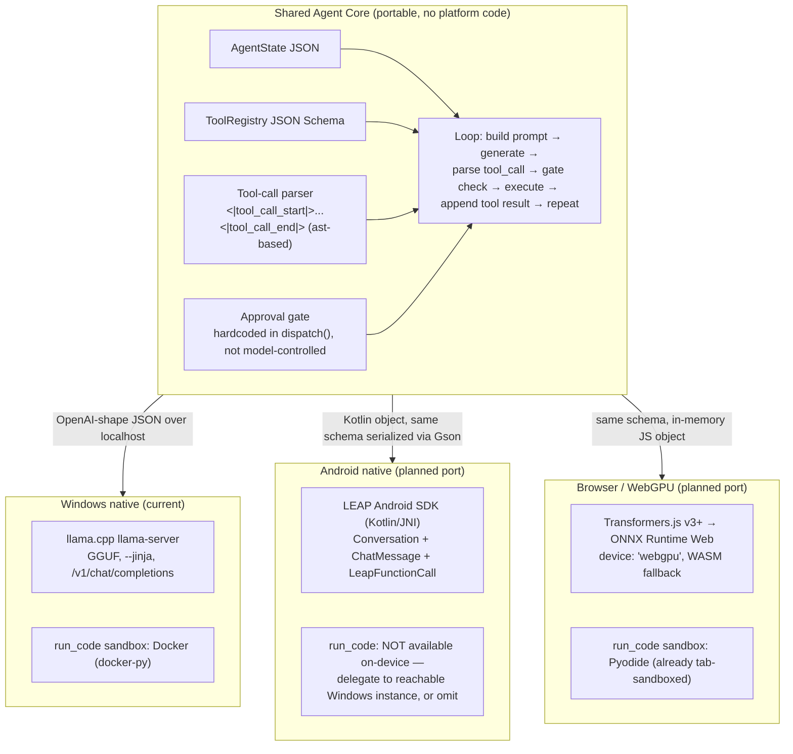
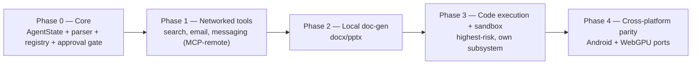
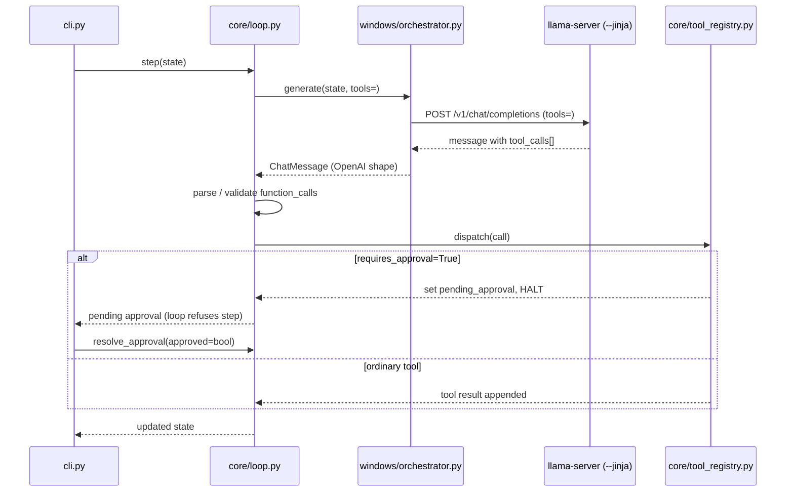

# Architecture

One model family (LFM2.5), three runtimes, one shared JSON contract. The core is portable; platforms are thin adapters.

## System diagram



**Rule:** the agent loop, tool registry, state machine, and **approval gate** live in the Core and are transport-agnostic. Each platform only implements a thin adapter that turns `AgentState → provider request` and `provider response → parsed ToolCall[]`, plus its own `run_code` sandbox backend.

## Build order (forced by dependency)



## Module layout

```
agent-core/
  schemas/                 # authoritative JSON Schemas (contracts)
    tool_definition.schema.json
    chat_message.schema.json
    agent_state.schema.json
  core/                    # portable agent core (Python, no platform code)
    __init__.py
    state.py               # pydantic AgentState / ChatMessage / PendingApproval
    parser.py              # ast-based Pythonic tool-call extraction, no eval (stdlib only)
    tool_registry.py       # schema validation on register(), approval gate in dispatch()
    loop.py                # step() / resolve_approval(), platform-agnostic
  tools/                   # real tool handlers
    registry.json          # all tool definitions (echo, run_code, networked, doc-gen)
    remote.py              # McpClient — stdlib JSON-RPC MCP tools/call transport (portable)
    __init__.py            # register_networked_tools / register_docgen_tools / register_runcode_tool
    create_docx.py         # python-docx handler (Phase 2)
    create_pptx.py         # python-pptx handler (Phase 2)
    run_code.py            # Docker sandbox handler, watchdog timeout (Phase 3)
  windows/                 # Windows transport (llama.cpp) — Phase 4
    server_config.ps1      # llama-server launch params
    orchestrator.py        # LlamaCppProvider: AgentState → OpenAI v3 request → ChatMessage
  cli.py                   # REPL: renders AgentState, streams text, resolves approvals
  Core-agent.bat           # one-click launcher: llama-server + Docker check + web UI + browser
  web/                     # Web UI + agent API server (stdlib only)
    server.py              # ThreadingHTTPServer; SSE API (token/tool_call/approval/done); sessions
    index.html             # SPA shell
    style.css              # dark local-first theme (approval amber, tool gray)
    app.js                 # renders AgentState, tool cards, approval modal, session sidebar
  core/sessions.py         # shared session lifecycle: system prompt, save/load/list/delete
  android/                 # planned port — structure reserved
    AgentCore.kt           # Kotlin port of core/ control flow
  test_smoke.py            # Phase 0 smoke test (approval gate proof)
  test_networked_tools.py  # Phase 1 (stdlib mock MCP-remote)
  test_docgen_tools.py     # Phase 2 (real .docx/.pptx round-trip)
  test_runcode.py          # Phase 3 (fake docker client)
  test_orchestrator.py     # Phase 4 (stubbed OpenAI client)
  test_web.py              # Web UI (fake provider + ephemeral server)
  requirements.txt         # pydantic, jsonschema, python-docx, python-pptx, docker, openai
  docs/                    # this documentation set
  models/                  # GGUF weights (gitignored)
  vendor/                  # llama.cpp binaries (gitignored)
```

## Data flow (Windows path, Phase 4)



## Approval gate (enforced in code, not convention)

1. Model emits `run_code(...)`.
2. `dispatch()` sees `requires_approval=True` → sets `AgentState.pending_approval`, loop halts.
3. UI surfaces the pending call to the human.
4. `resolve_approval(state, registry, approved=bool)` — only on `approved=True` does the Docker container / Pyodide worker actually run.

`pending_approval` is non-null exactly when a `requires_approval` tool call is waiting. The loop refuses to `step()` again until `resolve_approval()` clears it.

## Sandbox decisions (Phase 3)

| Tool | Windows | Android | WebGPU |
|---|---|---|---|
| create_docx | python-docx | Apache POI (heavy — reconsider for v1) | docx.js |
| create_pptx | python-pptx | Apache POI (heavy — reconsider for v1) | pptxgenjs |
| run_code | **Docker** (docker-py, `--network none` + limits) | **None** (delegate to Windows or omit) | **Pyodide** (tab-sandboxed) |

## Model selection (research doc §2)

Start with **LFM2.5-1.2B-Instruct** everywhere — one model, one prompt format, one set of quirks across all targets. Split models per platform only after measured data justifies it.

| Model | Target | Notes |
|---|---|---|
| LFM2.5-1.2B-Instruct | Windows default, Android mid-tier | native tool-calling; **the default** |
| LFM2.5-1.2B-Thinking | multi-step planning | higher latency; don't default |
| LFM2.5-2.6B | Windows daily-driver | needs ~8GB laptop/desktop |
| LFM2.5-8B-A1B (MoE) | Windows power tier / WebGPU | big first-load download |
| LFM2.5-350M / 230M | WebGPU / low-RAM | needs fine-tune to be usable for tools |

## Protocol decision

LFM2.5 emits native **Pythonic** calls (`func(arg="value")`) between the sentinel tokens. `core/parser.py` uses Python's `ast` module to extract them safely (no eval). On Windows, `--jinja` handles parsing natively; the parser covers raw paths (WebGPU, fallbacks).
