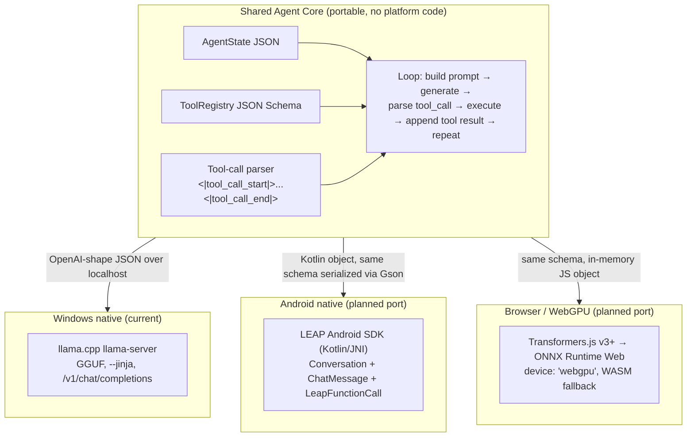
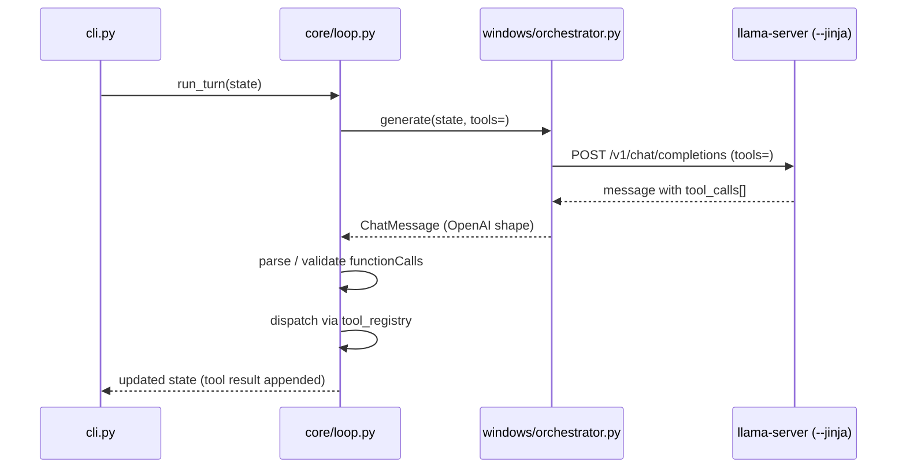

# Architecture

One model family (LFM2.5), three runtimes, one shared JSON contract. The core is portable; platforms are thin adapters.

## System diagram



**Rule:** the agent loop, tool registry, and state machine live in the Core and are transport-agnostic. Each platform only implements a thin adapter that turns `AgentState → provider request` and `provider response → parsed ToolCall[]`. Writing agent logic inside platform code duplicates it three times and it drifts.

## Module layout

```
agent-core/
  schemas/                 # authoritative JSON Schemas (contracts)
    tool_definition.schema.json
    chat_message.schema.json
    agent_state.schema.json
  core/                    # portable agent core (Python, no platform code)
    schemas.py             # pydantic models mirroring schemas/*.json
    loop.py                # platform-agnostic agent loop
    tool_registry.py       # tool dispatch table, validated at load time
    parser.py              # <|tool_call_start|>...<|tool_call_end|> → ToolCall[] (stdlib only)
    tools/
      registry.json        # stub reference tool definitions
      fs_tools.py          # stub tool implementations
  windows/                 # Windows transport (llama.cpp)
    server_config.ps1      # llama-server launch params
    orchestrator.py        # imports core.loop, wraps OpenAI client
  android/                 # planned port — structure reserved
    AgentCore.kt           # Kotlin port of core/loop.py control flow (ported, not reinvented)
  web/                     # planned port — structure reserved
    worker.js
    parser.js              # line-for-line port of core/parser.py
  tests/
    test_schemas.py
    test_tool_registry.py
    test_parser.py
    test_loop.py
  docs/                    # this documentation set
  models/                  # GGUF weights (gitignored)
  vendor/                  # llama.cpp binaries (gitignored)
```

## Data flow (Windows path, Phase 5)



## Model selection (from research doc §2)

Start with **LFM2.5-1.2B-Instruct** everywhere — one model, one prompt format, one set of quirks across all targets. Split models per platform only after measured latency/quality data justifies it.

| Model | Target | Notes |
|---|---|---|
| LFM2.5-1.2B-Instruct | Windows default, Android mid-tier | native tool-calling; **the default** |
| LFM2.5-1.2B-Thinking | multi-step planning | higher latency; don't default |
| LFM2.5-2.6B | Windows daily-driver | needs ~8GB laptop/desktop |
| LFM2.5-8B-A1B (MoE) | Windows power tier / WebGPU | big first-load download |
| LFM2.5-350M / 230M | WebGPU / low-RAM | needs fine-tune to be usable for tools |

## Protocol decision

LFM2.5 emits Pythonic calls (`func(arg="value")`) by default. This project forces **JSON-shaped calls** via the system-prompt instruction in the core prompt builder, so the single portable parser only ever handles JSON. On Windows, `--jinja` handles parsing natively; the parser covers raw paths (WebGPU, fallbacks).
